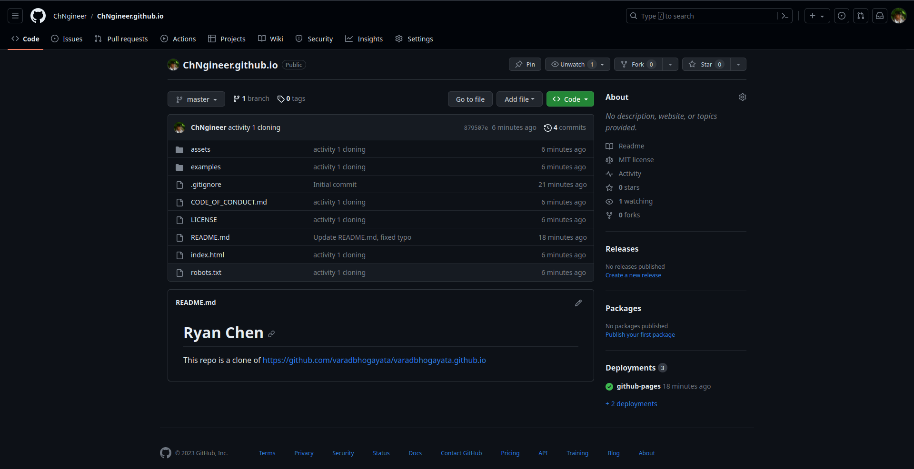
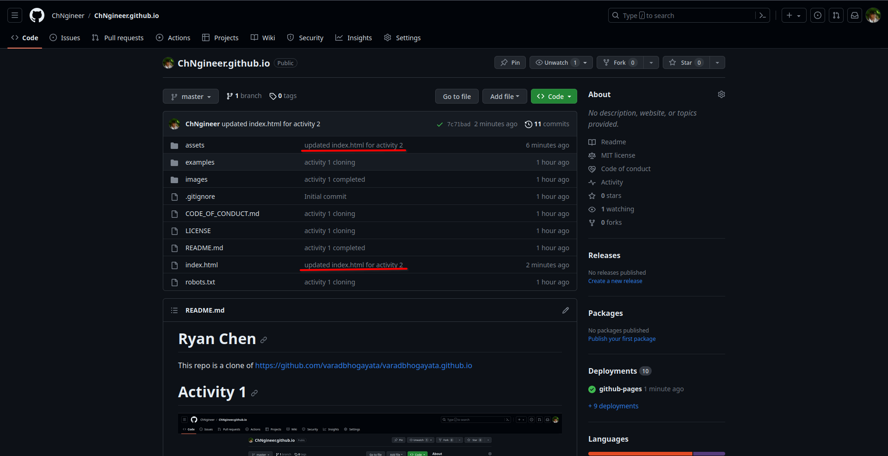
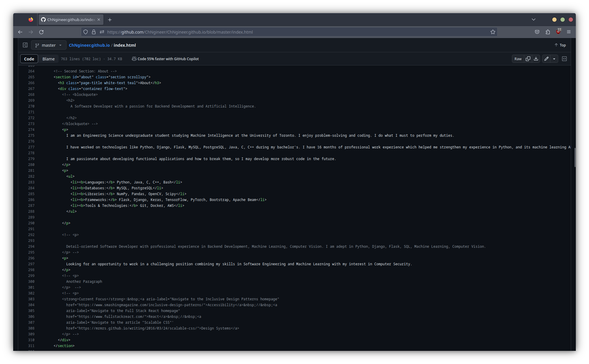
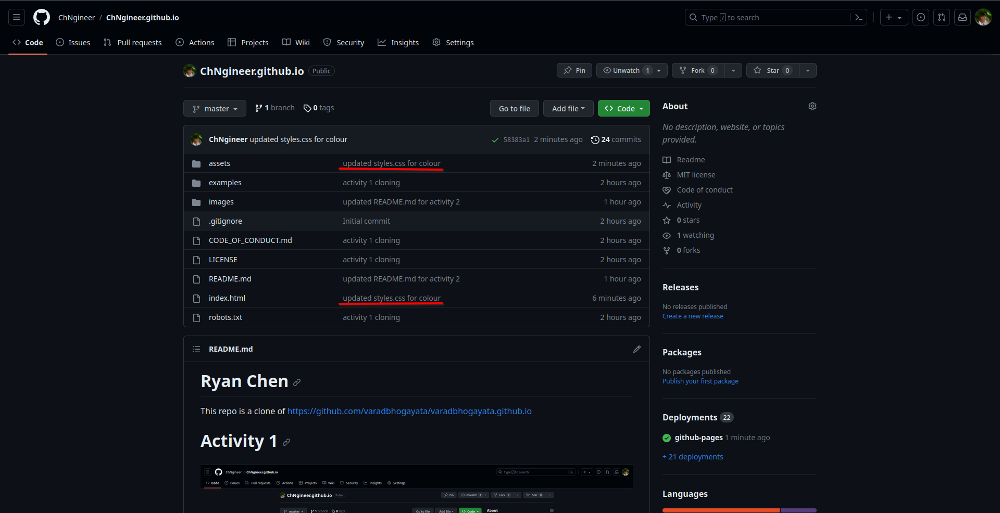
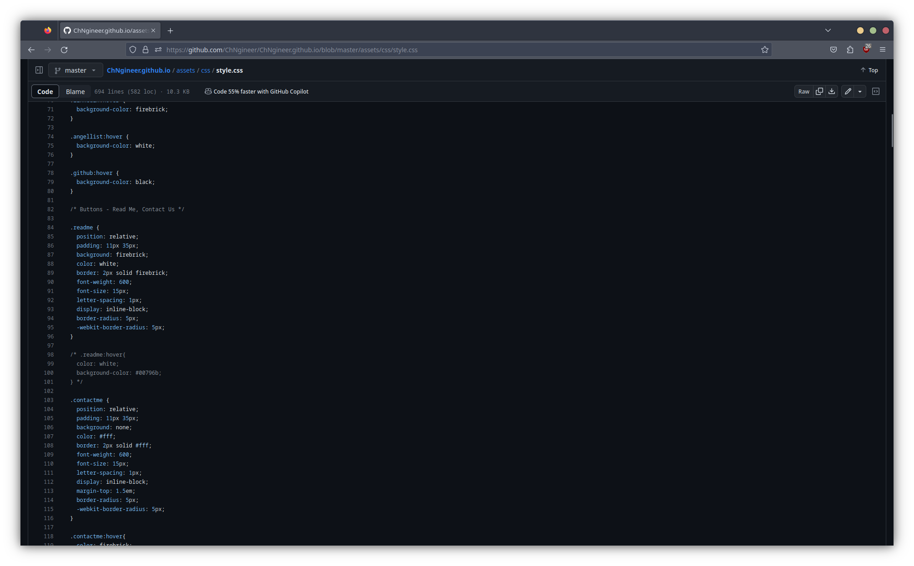
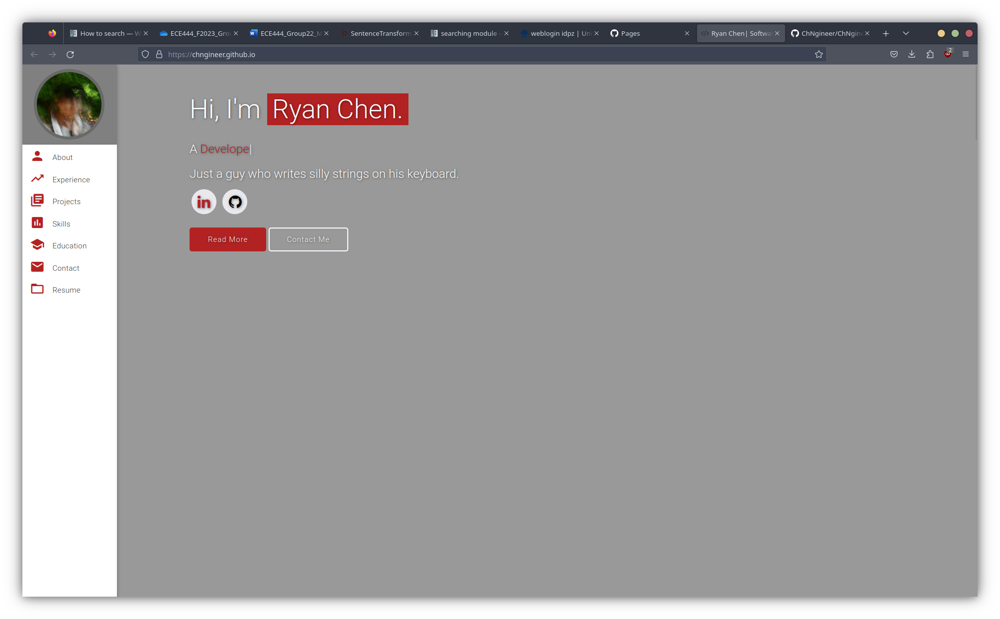
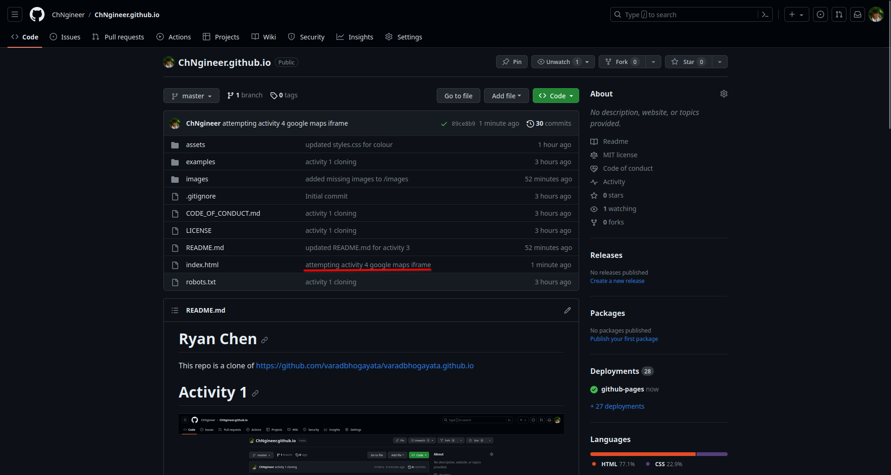
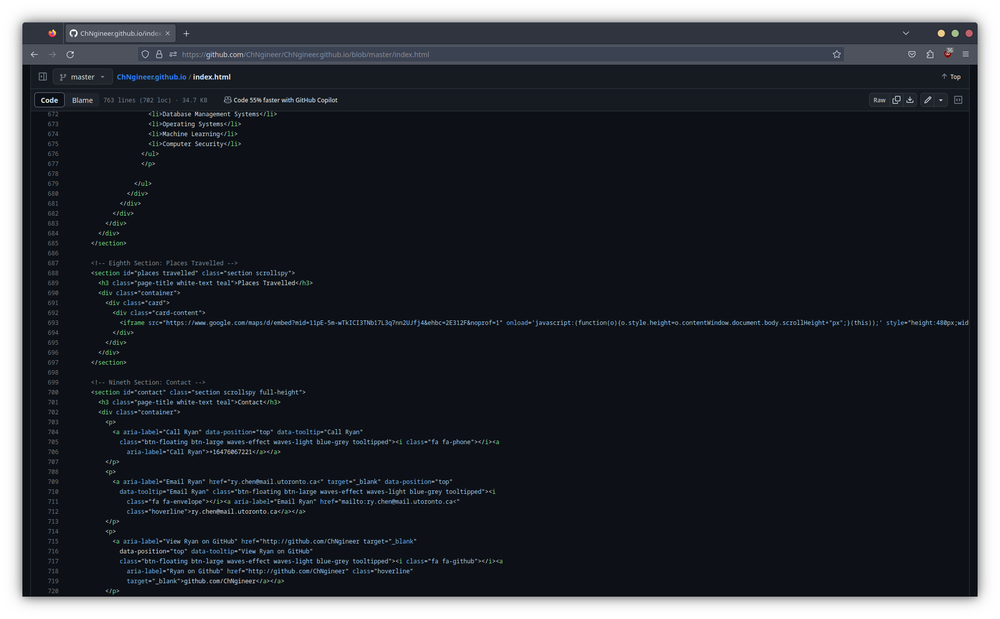
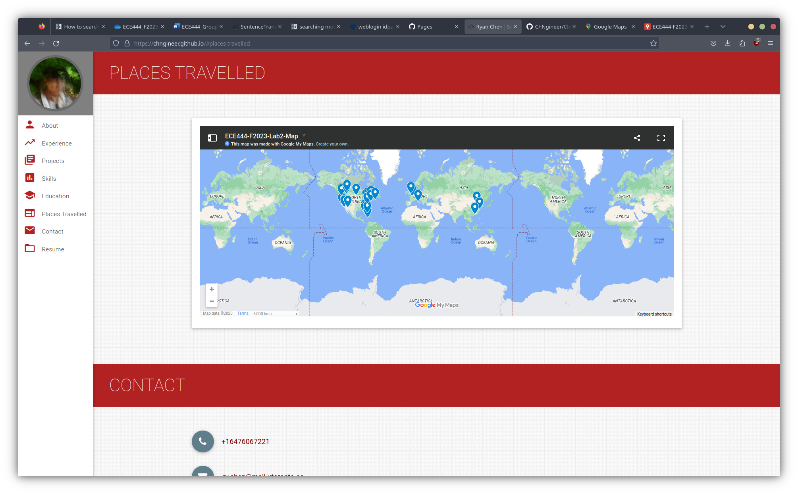

# Ryan Chen

This repo is a clone of https://github.com/varadbhogayata/varadbhogayata.github.io

# Activity 1

# Activity 2

Proof of changes made to the repository, check commits for more. Multiple updates were made to meet requirements for activity 2.

Example of changed code section:

Example of changes made to cloned repo. See https://github.com/ChNgineer/ChNgineer.github.io/tree/master/images for more screenshots of the website.

# Activity 3

Proof of changes made to the repository. Changes were made to https://github.com/ChNgineer/ChNgineer.github.io/tree/master/index.html and https://github.com/ChNgineer/ChNgineer.github.io/tree/master/assets/css/style.css

Example of changed css code for colour:

Proof of colour changes made to webpage. See https://github.com/ChNgineer/ChNgineer.github.io/tree/master/images for more examples.

# Actiity 4

Proof of changes made to the repository. Changes were mdae to https://github.com/ChNgineer/ChNgineer.github.io/tree/master/index.html. Following https://vibrantwebs.medium.com/google-maps-html-embed-with-multiple-locations-and-custom-markers-free-eab8fbce7f9a.

Changed code: 

Final Result

